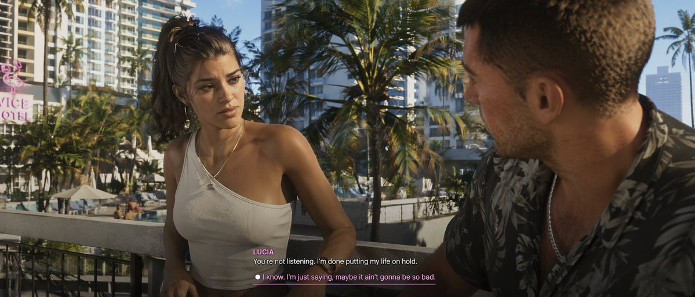
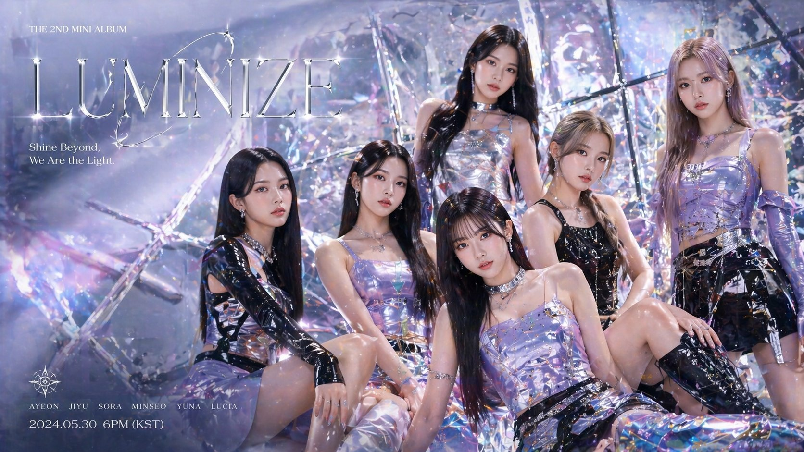
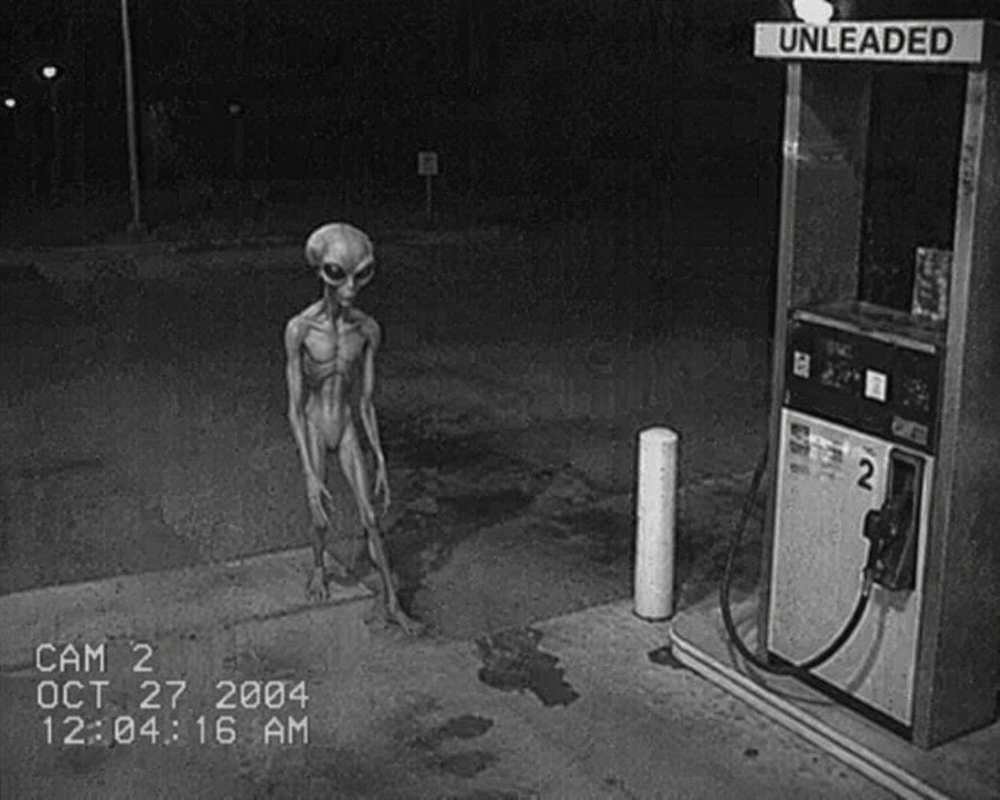
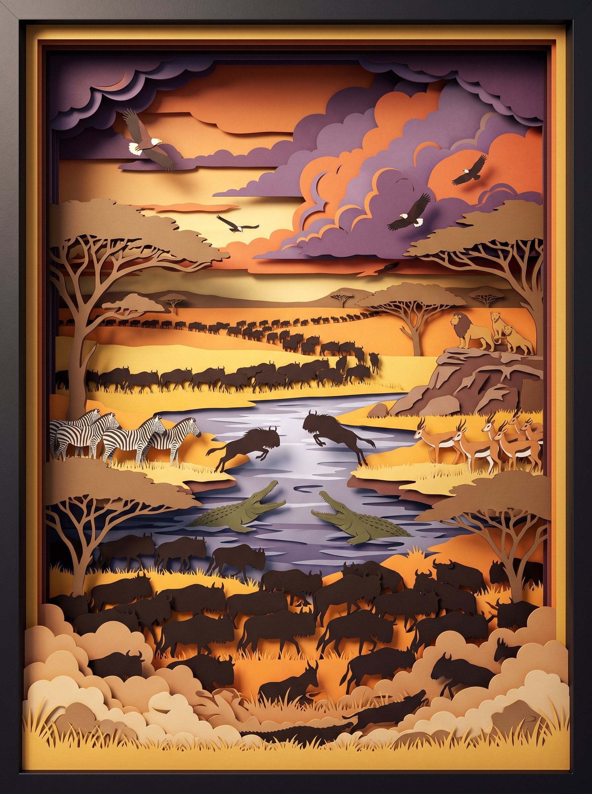

# Open Prompts 简介

**Open Prompts** 是一个开源的 **AI 图像提示词** 平台：把散落在文档和社群里的提示词整理成可复用的 **模板**（含预览图、标签、模型与公开范围），在画廊里发现、在创作页一键出图、也可提交或管理自己的模板。

- 仓库：[github.com/rudy2steiner/open-prompts](https://github.com/rudy2steiner/open-prompts)
- 许可：[Apache 2.0](LICENSE)
- 完整文档：[README.zh-CN.md](./README.zh-CN.md)

---

## 主要功能

- **画廊** — 按模型与标签浏览、搜索社区与内置模板，点开即用。
- **创作工作台** — 从模板带入提示词，调节比例与质量，对接 **Atlas Cloud** 出图（支持测试模式）。
- **提交与编辑** — 公开提示词进入审核；支持 `?visibility=private` 私有模板与 `?edit=` 编辑。
- **账户中心** — 管理「我的模板」；管理员可审核通过 / 拒绝。
- **登录** — GitHub、Google OAuth；管理员邮箱密码（无公开注册）。
- **X 导入** — 粘贴推文链接，自动填充标题、描述、提示词与图片。
- **多语言** — 英文 `/`、中文 `/zh`、日文 `/ja`。
- **自托管** — Next.js + Postgres（Supabase），可一键部署 [Vercel](https://vercel.com)。

---

## 社区精选示例

以下为内置画廊中的部分模板（来源社区 / X，节选展示）。克隆仓库后可在站点画廊中点击「生成」直接试用。

### GTA 6 风格都市写实



```
GTA 6 style cinematic scene, urban environment, high fidelity, hyper-realistic lighting --ar 1915:821
```

### K-pop 时尚专辑封面



```
K-pop group fashion album cover
```

### 高信息密度广告图


```
Professional advertisement image, high information density, rich details, high resolution polish
```

### 监控镜头「外星目击」



```
low quality photo of an alien being caught by a gas station camera, black and white image
```

### 敦煌壁画剪纸立体场景



```
Eye-level straight-on view, 3D layered paper cut-out diorama. Vermillion red, lapis lazuli blue, ochre gold. Flying apsaras with ribbon silk scarves, blooming lotus, swirling auspicious clouds, ornate medallion patterns. Deep drop shadows, matte paper texture, octane render, 8k --ar 3:4
```

> 更多模板见运行后的画廊，或执行 `npm run seed:prompts` 导入完整数据集。

---

适合需要 **统一沉淀提示词、团队共享、公开画廊 + 私有草稿** 的创作者与小型团队。部署与环境变量说明见 [README.zh-CN.md](./README.zh-CN.md)。
