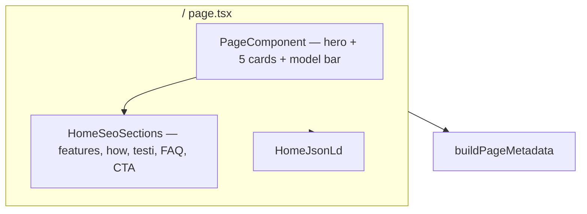
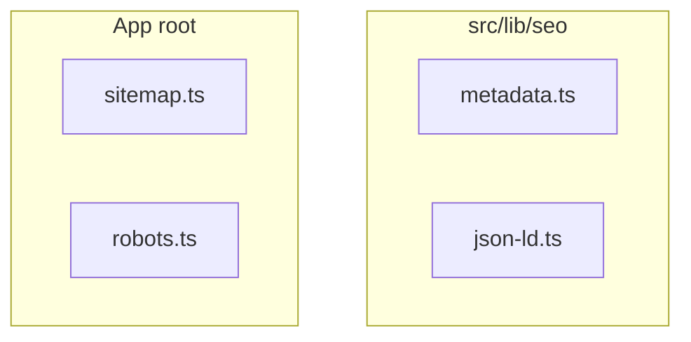

## Context

Open Prompts uses Next.js App Router with locales `en` (unprefixed), `zh`, `ja`. Production domain: **open-prompts.com**.

### External SEO audit (May 2026)

A third-party audit confirmed **near-zero Google indexing** for open-prompts.com:

| Finding | Severity | Current state |
|---------|----------|---------------|
| `site:open-prompts.com` returns **zero results** | 🔴 Critical | Site invisible to Google |
| `canonical` renders as `undefined` in page source | 🔴 Critical | No `metadataBase` + no `alternates.canonical` |
| `/sitemap.xml` unavailable / errors | 🔴 Critical | Not implemented |
| `/robots.txt` unverified | 🟠 High | Static `public/robots.txt` only; no sitemap reference |
| Gallery is client-rendered | 🟠 High | ~997 prompts not individually crawlable |
| No per-prompt indexable URLs | 🟠 High | All prompts share one `/gallery` page |
| Category/model filters use query params only | 🟡 Medium | `?model=` / `?category=` not indexable landing pages |
| Weak title differentiation vs competitors | 🟡 Medium | Generic gallery title |
| No `WebSite` / `ItemList` / `BreadcrumbList` schema | 🟡 Medium | FAQ JSON-LD only |
| Differentiator (X.com sourcing + on-site generation) not in SEO copy | 🟡 Medium | Missed positioning |

**Root cause:** Google cannot discover or canonicalize pages. Fixing metadata + sitemap + robots is necessary but **not sufficient** for ranking ~997 prompts — that requires Phase 2 (per-prompt SSR pages).

### Current routing (post landing split)

| Route | Role | Metadata today | Crawlability |
|-------|------|----------------|--------------|
| `/` | Marketing landing: visual hero + `HomeSeoSections` | `generateMetadata` → `homePage.seo` ✅ | SSR ✅ — indexable once canonical fixed |
| `/gallery` | Prompt grid (filters, search, masonry) | `generateMetadata` → `galleryPage.seo` ✅ | Metadata SSR ✅; **card content CSR** ❌ |
| `/submit`, `/login`, `/create`, `/account` | App pages | Inline `generateMetadata` ✅ | SSR metadata ✅ |
| `/privacy-policy`, `/terms-of-service` | Legal | Client `HeadInfo` ❌ | Broken canonical; legacy SoraWebui copy |

---

## Landing page reference (HTML mockup — May 2026)

Authoritative visual and copy target for `/`. Reference file: `references/landing-page.html` (pointer); full HTML in change discussion.

### Metadata (from mockup `<head>`)

| Field | Target (en) |
|-------|-------------|
| `<title>` | `Free GPT Image 2 Prompts Gallery — Community AI Prompts \| Open Prompts` |
| `<meta name="description">` | `Discover 997+ curated GPT Image 2 prompts from the community. Copy, remix, and generate stunning AI images with GPT Image 2, DALL·E 3, and Midjourney — free, daily updates.` |

Use dynamic prompt count (`{count}+`) from `getPromptGallery()` in description where possible.

### Visual design tokens (landing only)

Apply to `landing-page.css` + `PageComponent` / `HomeSeoSections`. **Do not** change gallery/app global theme in Phase 1b.

| Token | Mockup value | Current app |
|-------|--------------|-------------|
| Display font | `Playfair Display` (700/900, italic emphasis) | System / sans |
| Body font | `DM Sans` (300/400/500) | `font-sans` |
| Background | `#0a0a08` | `--bg: #0e0d0b` |
| Accent | `#e8c87a` (gold) | `--amber: #e8a020` |
| Surface | `#111110` / `#141412` cards | `--surface` |
| Muted text | `#7a776e` | `--text2` |

Load fonts via `next/font/google` or layout link — prefer `next/font` for performance.

### Section inventory (top → bottom)

| # | Mockup section | Component owner | SSR required |
|---|----------------|-----------------|--------------|
| 1 | Sticky nav | `OpenPromptsSiteHeader` (existing) | ✅ |
| 2 | Hero — eyebrow, H1, desc, CTAs, 4 stats | `PageComponent` | ✅ |
| 3 | Hero visual — **5** floating prompt cards | `PageComponent` | ✅ |
| 4 | **Model bar** — "Works with" filter pills | `HomeSeoSections` or `PageComponent` | ✅ links only |
| 5 | Features — eyebrow, H2, sub, **6** cards | `HomeSeoSections` | ✅ |
| 6 | How it works — 4 steps + **browser mockup** | `HomeSeoSections` | ✅ |
| 7 | Testimonials — **featured quote** + 3 cards | `HomeSeoSections` | ✅ |
| 8 | FAQ — sidebar + **6** accordion items | `HomeSeoSections` | ✅ (`<details>` OK) |
| 9 | CTA — centered, glow, 2 buttons | `HomeSeoSections` | ✅ |
| 10 | Footer | `OpenPromptsSiteFooter` (existing) | ✅ |

**Not in mockup (remove from landing):**

- Separate SEO hero block (`homePage.seoContent.hero` H2 below visual hero) — **merge into main hero**
- Browse-by-model **card grid** (3 cards)
- Browse-by-category **card grid** (4 cards)

**Replaced by:**

- Model bar (pills → `/gallery?model=…`)
- Footer SEO links: "GPT Image 2 Gallery", "DALL·E 3 Gallery" (→ gallery with model filter)

### Hero copy (en — from mockup)

| Element | Target |
|---------|--------|
| Eyebrow | `Community · Daily Updates from X` |
| H1 | `Free` + italic `GPT Image 2` + `Prompts Gallery` |
| Lead | `Discover **997+ curated GPT Image 2 prompts** from real creators on X. Copy any template, remix it, and generate stunning AI images with **GPT Image 2**, DALL·E 3, or Midjourney — directly in your browser. No account needed to browse.` |
| Primary CTA | `Browse GPT Image 2 Prompts` → `/gallery` |
| Secondary CTA | `Submit Your Prompt →` → `/submit` |
| Stats | `{count}+` AI Prompts · `6,200+` Members · `Daily` New Prompts · `Free` To Browse |

### Model bar

| Pill | Link target |
|------|-------------|
| All Models | `/gallery` |
| GPT Image 2 | `/gallery?model=GPT Image 2` |
| DALL·E 3 | `/gallery?model=DALL·E 3` |
| Midjourney | `/gallery?model=Midjourney` |
| Stable Diffusion | `/gallery?model=Stable Diffusion` |

Pills are **navigation links**, not client-side filters on `/`. No JS required for crawlability.

### Features (6 cards — en titles from mockup)

1. Curated GPT Image 2 Prompts
2. Generate On-Site, Instantly
3. Copy, Remix & Adapt
4. Filter by Model & Category
5. Daily Sync from X
6. Open & Community-Driven

Each description uses `.feat-kw` accent styling on "GPT Image 2" mentions (mockup pattern).

### How it works

- **Layout:** 2-column — steps left, browser mockup right
- **Steps:** 4 items with titles from mockup (Browse gallery → Copy → Generate on-site → Share & earn credit)
- **Browser mockup:** Decorative SSR HTML showing `open-prompts.com/prompt/vintage-travel-poster` in URL bar — **Phase 2 URL**; use as aspirational UI until `/prompt/[slug]` ships. Do not link to a 404.

### Testimonials

| Block | Structure |
|-------|-----------|
| Featured | Full-width quote + `@handle` + role + "Top Contributor" tag |
| Row | 3 cards with ★★★★★, quote, avatar emoji, `@handle`, role |

Use real X handles from mockup: `@Diplomeme`, `@noorlewisx`, `@Strength04_X`, `@Taaruk_`.

### FAQ (6 items — en questions from mockup)

1. What is Open Prompts and how does it relate to GPT Image 2?
2. Are the GPT Image 2 prompts free to use?
3. Can I use these prompts with models other than GPT Image 2?
4. How often are new GPT Image 2 prompts added?
5. How do I submit my own GPT Image 2 prompt?
6. What categories of GPT Image 2 prompts are available?

**Layout:** Left sidebar ("Everything you need to know" + contact box with GitHub / X links). Right: accordion list. Use native `<details>` for SSR (mockup uses JS `toggleFaq` — **do not require JS**).

**Sidebar contact:** `Still have questions? Reach us on GitHub or X @openpromptsapp`

### CTA (en)

- Title: `Start generating with` + italic `GPT Image 2` + `today`
- Sub: `Join 6,200+ creators browsing the best free **GPT Image 2 prompt** gallery…`
- Buttons: `Browse GPT Image 2 Prompts →` · `Submit a Prompt`
- Note: `Free to browse · {count}+ curated prompts · Daily updates from X`

### IA deltas: mockup vs app

| Mockup | App decision | Rationale |
|--------|--------------|-----------|
| Nav "Gallery" active | **Home** tab active on `/` | Landing/gallery split already shipped |
| Nav "Models", "Docs" | **Omit** for now | No routes; avoid dead links |
| Nav "Share a Prompt" | Maps to **Submit** in header | Existing `OpenPromptsSiteHeader` CTA |
| Single-page gallery | `/` landing + `/gallery` tool | Keep split |
| Model bar in-page filter | Links to `/gallery?model=` | SSR-friendly discovery |
| `/prompt/…` in browser mockup | Decorative only until Phase 2 | No broken links |

### Delta: mockup vs current implementation

| Area | Current | Target (mockup) |
|------|---------|-----------------|
| H1 | `Explore. Reuse. Create.` | `Free *GPT Image 2* Prompts Gallery` |
| Hero cards | 3 previews | 5 floating cards |
| SEO hero block | Separate H2 section | Merged into hero |
| Features | 3 generic cards | 6 GPT Image 2-focused cards |
| How it works | 4-step ordered list | 4 steps + browser mockup column |
| Testimonials | 3 plain quotes | Featured + 3 star cards |
| FAQ | 5 items, single column | 6 items, sidebar + accordion |
| Browse cards | Model + category grids | **Removed**; model bar + footer links |
| Keyword density | ~3% GPT Image 2 | **~5–7%** in body (mockup-aligned) |
| Typography | Sans only | Playfair + DM Sans on landing |
| `homePage.seo.title` | Generic | Mockup `<title>` pattern |

---

## Goals / Non-Goals

### Phase 1a goals — indexing pipeline

- Fix `metadataBase` + canonical + hreflang (`src/lib/seo/metadata.ts`)
- `sitemap.ts`, `robots.ts`
- `WebSite` + `SearchAction` + `ItemList` + `FAQPage` `@graph`
- Migrate privacy/terms off `HeadInfo`
- `og-default.png`

### Phase 1b goals — landing redesign (mockup)

- Restyle `/` per reference mockup (typography, colors, layout)
- Rewrite `homePage` + `homePage.seoContent` i18n to mockup copy (en); zh/ja parity
- Merge SEO hero into visual hero; add model bar; 6 features; browser mockup; featured testimonial; 6 FAQs
- Update `homePage.seo` title/description to mockup `<head>` values
- Remove browse-by-model/category card grids from landing
- Add footer gallery SEO links (model-filter deep links)
- Hero floating cards: 5 prompts from `getPromptGallery()`

### Phase 1 non-goals

- Per-prompt URLs (Phase 2) — browser mockup URL is decorative
- Indexable `/category/` or `/model/` path routes
- Site-wide Playfair/DM Sans on gallery/app pages
- Blog / resource section

### Phase 2 goals (`optimize-seo-content-indexing`)

- `/prompt/[slug]` SSR pages; `/category/[slug]`, `/model/[slug]` routes
- Dynamic sitemap; `ImageObject` + `BreadcrumbList`
- Browser mockup URL becomes real link

## Keyword strategy

| Keyword / intent | Phase 1b (landing) | Phase 2 |
|------------------|---------------------|---------|
| `GPT Image 2 prompts` | H1, title, meta desc, features, FAQ | `/model/gpt-image-2` |
| `AI image prompt gallery` | Title + CTA | `/gallery` |
| `free AI prompts community` | Hero + features | — |
| X.com sourcing differentiator | Hero eyebrow, feature #5, FAQ | Per-prompt attribution |
| On-site generation | Features #2, how-it-works step 3 | — |

### Keyword density rule (revised)

**Previous:** ~3% "GPT Image 2" across `seoContent`.

**New (mockup-aligned):**

| Zone | Target |
|------|--------|
| `<title>`, meta description, H1 | Front-load "GPT Image 2" once each |
| Hero lead paragraph | 2× "GPT Image 2" |
| Features + how-it-works + FAQ body | **~5–7%** phrase density in en (`feat-kw` / `step-kw` spans) |
| Testimonials | 1× per card max (natural) |
| CTA | 1–2× |

Run word-count script before merge; cap at 7% to avoid stuffing flags.

### Title tags

| Page | Target (en) |
|------|-------------|
| Home | `Free GPT Image 2 Prompts Gallery — Community AI Prompts \| Open Prompts` |
| Gallery | `Free AI Image Prompts Gallery — GPT Image 2, Midjourney, DALL·E \| Open Prompts` |

## Decisions

### 1. Home vs gallery SEO ownership

**Decision:** `/` owns all marketing SEO (mockup sections). `/gallery` owns tool UI + gallery-specific metadata only.

### 2. Central SEO module (`src/lib/seo/`)

Unchanged — see prior design. `buildPageMetadata()` + `json-ld.ts`.

### 3. `metadataBase` in locale layout

Unchanged. Fixes `canonical: undefined`.

### 4. JSON-LD on home

Unchanged. FAQ items expand to **6** after mockup copy migration. `ItemList` uses up to 20 prompts; hero cards use 5.

### 5. Sitemap / robots / legal / og image

Unchanged from Phase 1a.

### 6. Landing component split

**Decision:**

```
PageComponent.tsx     — Hero (copy, stats, CTAs), 5 floating cards, model bar
HomeSeoSections.tsx   — Features, how-it-works (+ browser mockup), testimonials, FAQ, CTA
landing-page.css      — All mockup styles (Playfair, DM Sans, gold accent, animations)
```

### 7. FAQ accordion without JS

**Decision:** Use `<details>/<summary>` instead of mockup's `toggleFaq()` JS. First item `open` by default via `open` attribute.

### 8. Browse card removal

**Decision:** Remove model/category card grids from `HomeSeoSections`. Discovery via model bar + footer links + gallery page.

**Rationale:** Mockup omits bottom grids; reduces duplicate internal links; model bar is more prominent.

### 9. Phase split rationale

Unchanged. Phase 1b landing improves on-page SEO signals; Phase 2 adds index depth.

## Architecture

### Phase 1b landing



### Phase 1a + discovery



## Multi-agent parallelization

Tasks are split into **10 agents (A–K)** across 4 waves. See `tasks.md` for:

- Agent roster with **exclusive file ownership**
- Dependency graph (Wave 1 → Wave 2 ×5 parallel → Wave 3 ×4 parallel → Wave 4 integrate)
- Copy-paste dispatch prompts per agent
- Conflict rules (`page.tsx`, `messages/*.json`, `landing-page.css`)

**Max parallelism:** 5 agents in Wave 2, 4 in Wave 3, after Agent A (seo-foundation) lands.

## Implementation order

### Phase 1a — indexing pipeline (first)

1. `metadata.ts` + layout `metadataBase`
2. `buildPageMetadata` on all public routes
3. `sitemap.ts`, `robots.ts`
4. `json-ld.ts` + `HomeJsonLd`
5. Privacy/terms; delete `HeadInfo`
6. `og-default.png`

### Phase 1b — landing mockup (after 1a or parallel)

1. Update `homePage.seo` title/description (mockup `<head>`)
2. Rewrite `homePage.seoContent` + hero keys in en.json (mockup copy)
3. Restyle `landing-page.css` (tokens, Playfair, DM Sans, animations)
4. Refactor `PageComponent` — hero copy, 5 cards, model bar
5. Refactor `HomeSeoSections` — 6 features, browser mockup, featured testimonial, 6 FAQ sidebar layout, CTA; remove browse grids
6. Update `OpenPromptsSiteFooter` — model gallery SEO links
7. zh/ja parity pass
8. Keyword density check (~5–7%)
9. Verification: view-source all sections SSR; no JS-only content

### Phase 2 — content indexing

Unchanged.

## Risks / Trade-offs

- **[Risk] High GPT Image 2 density triggers stuffing** → Cap at 7%; vary phrasing ("OpenAI image model")
- **[Risk] Playfair/DM Sans CLS** → Use `next/font` with `display: swap`
- **[Risk] Browser mockup shows `/prompt/…` before Phase 2** → Decorative text only, not a link
- **[Risk] Removing browse cards reduces category internal links** → Footer + gallery retain category discovery
- **[Trade-off] Landing theme diverges from gallery** → Acceptable; unify later if needed

## Open Questions

- **Canonical origin:** `www` vs apex
- **Members stat `6,200+`:** Hardcoded in mockup — use real metric or keep static?
- **Stable Diffusion pill:** Include only if gallery has SD-tagged prompts
- **Featured testimonial @handles:** Confirm permission / accuracy before publish
