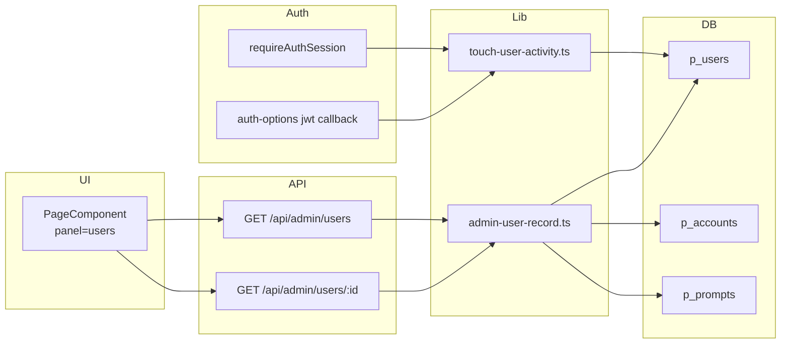

## 上下文

Open Prompts 使用 **NextAuth（JWT）** + **Postgres**（`p_users`、`p_accounts`）。管理员身份由环境变量 **`ADMIN_EMAIL`**（逗号分隔）与 `isAdminEmail()` 判定。账户页 `/account` 已有 **Moderation** 面板，对接 `GET/PATCH /api/admin/templates`。

当前无用户管理 UI/API，运营需直接查库。本变更提供 **只读用户目录 + 平台级监控指标**，为后续完整管理后台（封禁、RBAC 等写操作）铺路。

**约束**

- 布局与现有账户中心一致（`max-w-7xl`、站点 header/footer、侧边栏、Tailwind + daisyUI）
- 复用 Moderation 面板的分页、表格、指标卡（`op-account-metrics`）交互
- API 路由走 locale 作用域；`next.config.mjs` 已有 `/api/admin/:path*` 重写
- 无公开自助注册；用户通过 OAuth 或管理员凭据首次登录时写入 `p_users`

## 目标 / 非目标

**目标**

- 管理员可分页浏览用户，按邮箱/姓名搜索（`q`）
- 列表展示：用户摘要、角色、`providers`、注册时间（含分钟，locale 格式化）
- 行点击拉取 `GET /api/admin/users/:id` 详情（OAuth 提供商、`templateCount`、`isEnvAdmin`）
- 面板顶部展示平台级指标：`totalUsers`、`activeToday`（UTC DAU）、`newToday`（UTC 当日注册）
- 指标下方展示近 **7 个 UTC 自然日** 的 **用户新增** 与 **Prompt 新增** 日趋势（并排柱状图）
- 所有 `/api/admin/users/*` 为 **GET only**，需 `isAdminEmail(session.user.email)`
- 三语 i18n（键位于 `messages/*.json`）

**非目标**

- 禁用/启用、封禁、`PATCH`/`DELETE` 用户 API
- 除 `last_active_at` 外的 `p_users` schema 变更
- 可配置趋势窗口、导出 CSV、实时 websocket、第三方 chart 库
- 举报、收入、审计日志、DB RBAC（任务 2.13）

## 系统架构



**读路径**：Users 面板 → 列表 API 一次返回 `{ items, total, hasMore, stats }`；行点击 → 详情 API。

**写路径（仅 DAU）**：登录或 `requireAuthSession` → `touchUserActivity` → 条件更新 `last_active_at`（每用户每 UTC 日最多一次）。

## 数据模型

### 既有表（只读查询）

| 表 | 用途 |
|----|------|
| `p_users` | 用户主表：`id, email, name, image, created_at, …` |
| `p_accounts` | OAuth 关联：`user_id, provider`（`github` / `google`） |
| `p_prompts` | `submitted_by` 聚合为 `templateCount` |

### 新增字段（本变更唯一 schema 增量）

| 列 | 类型 | 说明 |
|----|------|------|
| `p_users.last_active_at` | `timestamptz` NULL | 最近一次认证活跃时间；用于 DAU |

**Migration**：`supabase/migrations/20260520140000_p_users_last_active_at.sql`  
**索引**：`p_users_last_active_at_idx`（`last_active_at DESC`）

> 邮箱密码用户若无 `p_accounts` 行，列表 Provider 列显示「Email」；有 OAuth 则显示 `GitHub` / `Google`（首字母大写）。

## API 契约

### `GET /api/admin/users`

**守卫**：`requireAuthSession` + `isAdminEmail`

**Query**

| 参数 | 默认 | 说明 |
|------|------|------|
| `q` | — | 对 `email`、`name` 做 `ILIKE` 部分匹配 |
| `limit` | 20 | 上限 100 |
| `offset` | 0 | 分页偏移 |

**Response 200**

```json
{
  "items": [
    {
      "id": "uuid",
      "email": "user@example.com",
      "name": "Display Name",
      "image": "https://…",
      "createdAt": "2026-05-20T10:30:00.000Z",
      "isEnvAdmin": false,
      "providers": ["github"]
    }
  ],
  "total": 42,
  "limit": 20,
  "offset": 0,
  "hasMore": true,
  "stats": {
    "totalUsers": 100,
    "activeToday": 12,
    "newToday": 3,
    "trendDays": 7,
    "dailyTrend": [
      { "date": "2026-05-14", "newUsers": 1, "newPrompts": 4 },
      { "date": "2026-05-15", "newUsers": 0, "newPrompts": 2 }
    ]
  }
}
```

| 字段 | 范围 | 说明 |
|------|------|------|
| `total` | 受 `q` 过滤 | 当前搜索结果总数（分页用） |
| `stats.*` | **全平台** | 不受 `q` 影响 |

**`stats` 计算（UTC 自然日）**

- `totalUsers`：`COUNT(*)` from `p_users`
- `activeToday`：`last_active_at >= startOfUtcDay()`
- `newToday`：`created_at >= startOfUtcDay()`
- `trendDays`：固定 `7`（含当日）
- `dailyTrend`：长度为 `trendDays` 的数组，按日期升序；缺失日期补 `0`
  - `newUsers`：该 UTC 日 `p_users.created_at` 计数
  - `newPrompts`：该 UTC 日 `p_prompts.created_at` 计数（全表，含种子数据）

**查询**：`GROUP BY date(created_at AT TIME ZONE 'UTC')`，窗口起点 = 今日 UTC 0:00 往前 `trendDays - 1` 天。

### `GET /api/admin/users/:id`

**Response 200**：列表项字段 + `providers[]`、`templateCount`  
**404**：用户不存在  
**403**：非管理员

### 写接口

本能力下 **不提供** `PATCH` / `DELETE`；应返回 405 或路由不存在。

## UI 设计

### 入口与权限

- 侧边栏 **Users**（`panel=users`），仅 `isAdmin` 可见
- `panelFromSearchParam`：非管理员访问 `users` / `admin` 强制回 `overview`

### 面板布局（自上而下）

1. **说明文案**（`adminUsers.hint`）
2. **指标卡**（复用 `op-account-metrics`，三列）
   - 用户总数 ← `stats.totalUsers`
   - 今日活跃 ← `stats.activeToday`
   - 今日新增 ← `stats.newToday`
3. **日趋势**（`op-account-trend`，两列 grid）
   - 左：**用户新增** — `dailyTrend[].newUsers` 柱状图
   - 右：**Prompt 新增** — `dailyTrend[].newPrompts` 柱状图
   - 柱高 = 相对本系列最大值的比例；`title` 显示 `date` 与精确计数
   - X 轴标签：UTC 日期 `MM/DD`（或 locale 短格式）
   - **不引入** recharts 等依赖
4. **工具栏**：搜索框 + 刷新
5. **分页**（与 Moderation 同组件逻辑）
6. **表格**

### 表格列

| 列 | 数据源 | 展示规则 |
|----|--------|----------|
| User | `name` / `email` + avatar | 与 Moderation 行样式一致 |
| Role | `isEnvAdmin` | Env admin 徽章 / Member |
| Provider | `providers[]` | 有 OAuth → `GitHub, Google`；无 → `Email` |
| Joined | `createdAt` | locale 日期时间，**含分钟**（`toLocaleString`，`zh-CN` / `ja-JP` / `en-US`） |
| Actions | — | View → 打开详情模态 |

### 详情模态

- 用户资料、Role、Providers、Template count、Joined（同列表时间格式）
- 无编辑、无封禁按钮

## 技术决策

### 1. 只读用户 API + 最小 schema 增量

- **决策**：用户 CRUD 只读；唯一新增列为 `last_active_at`（DAU）
- **理由**：运营可见性优先；封禁/RBAC 独立变更

### 2. 列表 API 与 Moderation 同形，并附带 `stats`

- **决策**：`{ items, total, hasMore, stats }`；列表项含 `providers`（批量 `inArray` 查 `p_accounts`）
- **理由**：一次请求刷新表格与指标；避免独立 stats 端点

### 3. 详情按需加载

- **决策**：列表轻量；行点击 `GET /:id` 拉 `templateCount` 与完整 providers
- **理由**：减少列表 N+1 模板计数查询

### 4. 管理员标识只读

- **决策**：`isEnvAdmin = isAdminEmail(email)`，无写接口
- **理由**：与现有 `ADMIN_EMAIL` 引导一致，直至任务 2.13

### 5. 面板 ID：`users`

- **决策**：与 `panel=admin`（Moderation）分离；URL 守卫同 `admin`
- **理由**：职责分离、防止非管理员 URL 绕过

### 6. DAU：`touchUserActivity`

- **决策**：在 **JWT 登录**（credentials / OAuth）与 **`requireAuthSession`** 中 fire-and-forget 调用
- **决策**：`UPDATE … WHERE last_active_at IS NULL OR last_active_at < startOfUtcDay()`，避免同日重复写
- **局限**：仅浏览静态页且未触发认证 API 的用户不计入 DAU；可接受（最小实现）
- **理由**：无独立 analytics 服务；写入量可控（每用户每日 ≤1 次）

### 7. Provider 展示约定

- **决策**：DB 存 `github` / `google`；UI 映射为 `GitHub` / `Google`；无 account 行 → i18n `providerEmail`
- **理由**：与登录页品牌一致；邮箱用户可辨识

### 8. 注册时间格式

- **决策**：列表与详情均使用 `formatJoinedAt(iso, locale)`，含年月日 + 时:分
- **理由**：运营排查需精确到分钟；随 locale 本地化

### 9. 日趋势：折线图 + 可选窗口（最长 3 月）

- **决策**：`stats.dailyTrend` 随列表 API 返回；UI 为 **SVG 折线图**（无 chart 库）
- **决策**：`GET /api/admin/users?trendDays=` 仅允许 `7`（1 周）、`30`（1 月）、`90`（3 月，上限）；默认 `30`
- **决策**：口径仍为 **每日新增**（`created_at`），非历史 DAU 回溯
- **理由**：满足 1 周～3 月运营查看；折线更适合长序列

## 风险与缓解

| 风险 | 缓解 |
|------|------|
| 邮箱等 PII 暴露 | 仅管理员 GET；无公开目录 |
| 列表 providers 批量查询 | 单页最多 100 用户，`inArray` 一次查 accounts |
| `templateCount` 慢 | `p_prompts_submitted_by_idx`；仅详情或按需聚合 |
| migration 未执行 | `last_active_at` 缺失时 DAU 查询失败 → 部署前跑 migration；列可空不影响列表 |
| DAU 低估 | 文档说明口径；后续可加 activity 日表 |
| 趋势含种子 Prompt | 全表 `p_prompts.created_at`；运营知悉即可 |

## 部署与回滚

1. **先** 执行 migration `20260520140000_p_users_last_active_at.sql`
2. 部署 API + Users 面板 UI
3. **回滚**：隐藏 UI、移除 API 路由；`last_active_at` 可保留（可空）

## 待定事项

- UI 迁至 `/admin/users` 时保持 `/api/admin/users` 不变
- 用户封禁/禁用独立变更（`disabled_at`、Auth 拦截、`PATCH`）
- DAU 趋势（7 日折线）与导出 — 非本变更范围
- 历史 DAU 按日回溯（需 activity 日表）— 非本变更范围

## 实现顺序（design → apply）

> **须先评审本文 design，再执行 `tasks.md` apply。**

1. 数据层 + migration（`admin-user-record.ts`、`touch-user-activity.ts`）
2. 只读 API（列表含 stats、详情）
3. 账户中心 UI（指标卡、表格列、详情模态）
4. Auth 挂钩（`touchUserActivity`）
5. i18n（en / zh / ja）
6. 验证（build、403、面板守卫）
